<p align="center">
  
</p>

<h1 align="center">⬇️ KMJ DOWNLOADER</h1>

<p align="center">
  <b>yt-dlp based all-social-media video downloader for Termux — CLI with animated UI</b><br>
  Made By <b>KMJ TIPS CHANNEL</b> 💛
</p>

<p align="center">
  
  
  
  
</p>

<p align="center">
  
</p>

---

## ⚡ One-Click Setup (Termux)

```bash
bash setup.sh
```

Setup automatically installs `python`, `ffmpeg`, `curl`, `yt-dlp`, `rich` →
creates the **KMJ TIPS** folder → installs the `kmj` command.

> First run me `termux-setup-storage` ka popup **Allow** karna — taaki videos
> Download folder me save ho sakein.

## 🚀 Run

```bash
kmj
```

## ✨ Features

| Feature | Detail |
|---------|--------|
| 🌐 1000+ Sites | YouTube, Instagram, Facebook, TikTok, Twitter/X, Snapchat, Pinterest, Reddit, Dailymotion, Twitch, Moj, Josh, Roposo + more |
| 🎞️ Animated UI | Color-cycling KMJ banner, spinners, styled menus |
| 📊 Live Progress | Animated progress bar — speed, ETA, % line animation |
| 🎚️ Quality Picker | Best / 1080p / 720p / 480p / 360p / MP3 |
| 📋 All Qualities | Full format list — resolution, FPS, size, codec — pick any |
| 📦 Batch Mode | Paste multiple links, download sab ek saath |
| 🎵 MP3 Mode | One-tap audio extraction (192kbps) |
| 📁 Auto Folder | Sab kuch **KMJ TIPS** folder me save |
| 📃 Playlist | Playlist link par full-playlist download ka option |

## 📋 Menu

```
[1] 🎬 Download Video          — single link, quality picker
[2] 📦 Batch Download          — bulk links, ek saath download
[3] 🎵 Download Audio (MP3)    — audio only
[4] 🌐 Supported Sites         — site list
[5] 📁 Open Download Folder
[6] ❌ Exit
```

## 📁 Files

| File | Kaam |
|------|------|
| `setup.sh` | One-click Termux setup |
| `kmj.py` | Main tool (installed as `kmj` command) |
| `assets/logo.png` | Project logo |
| `assets/demo.svg` | Animated demo for README |

## 📝 Notes

- Videos save hoti hain: `~/storage/downloads/KMJ TIPS/`
- YouTube kabhi-kabhi bot-check lagata hai — apne phone ke net par normally kaam karta hai.
- Kuch sites (Instagram/Facebook) login-cookies maang sakti hain — `--cookies` support jald aayega.

## 💛 Credits

**Made By KMJ TIPS CHANNEL** — Hindi APK modding & tech tutorials.

⭐ Star karna mat bhoolna!
